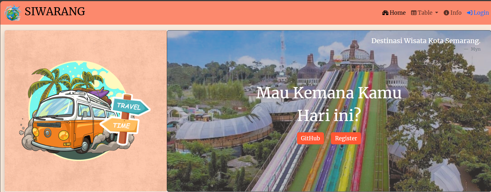
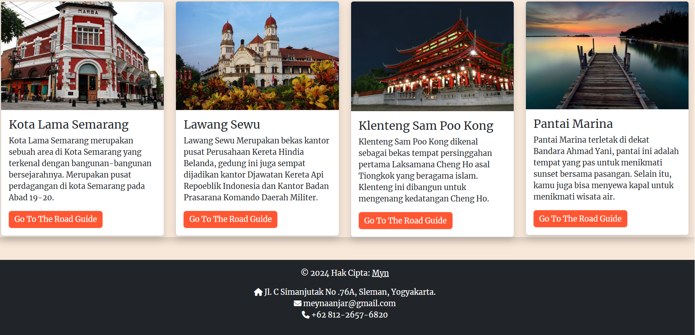
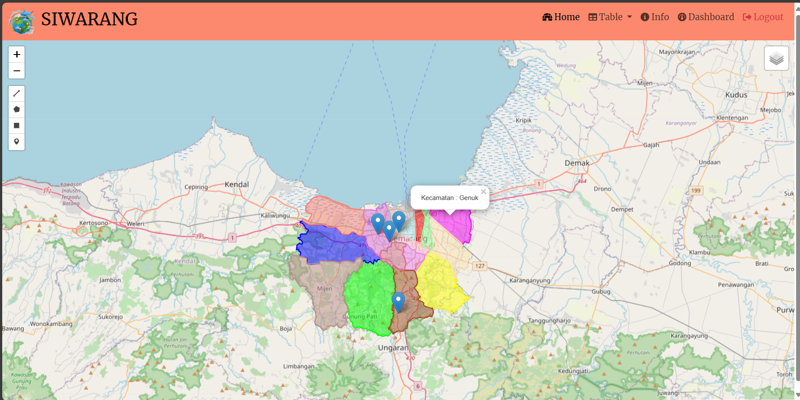
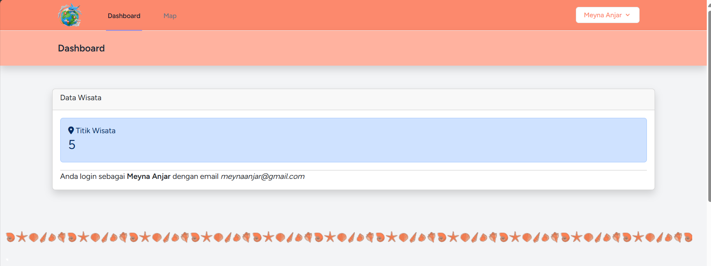
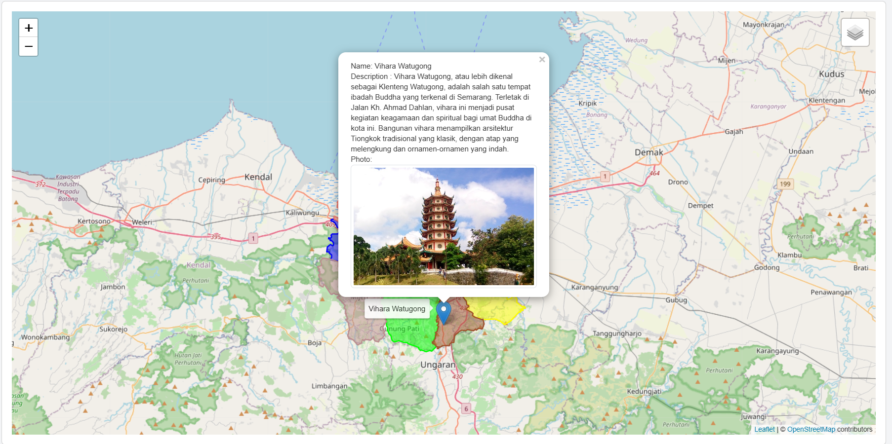
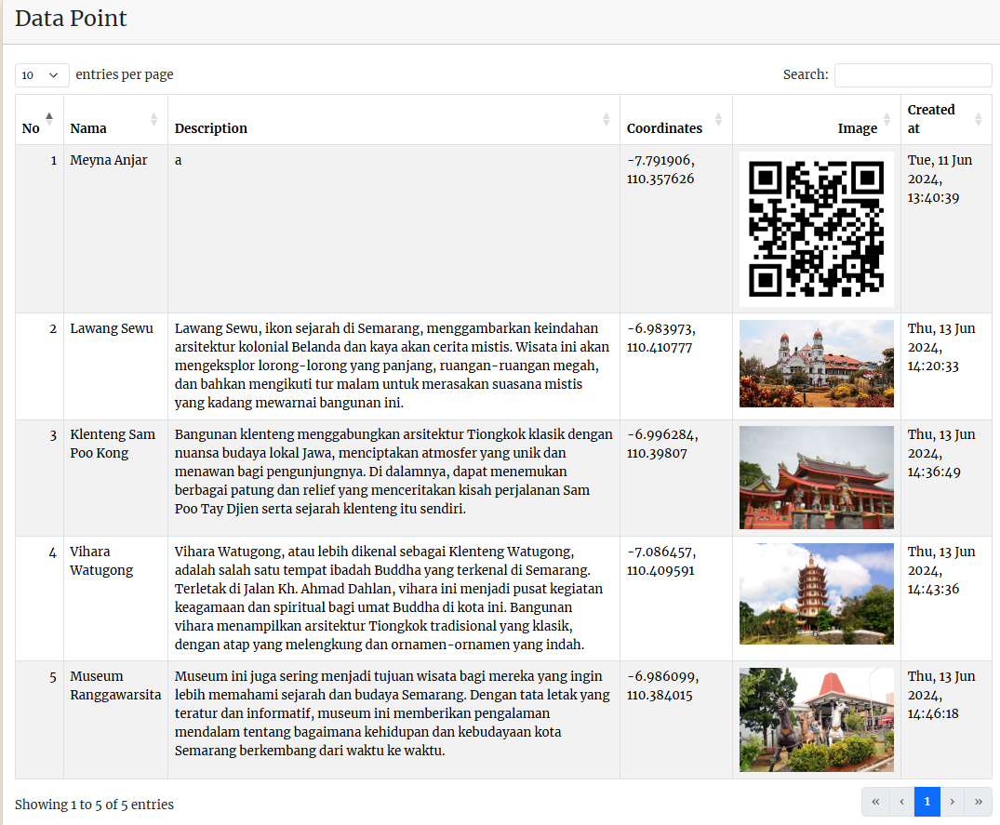

# pgweb-responsi

# SIWARANG (Destinasi Wisata Kota Semarang)

## Deskripsi Produk

SIWARANG merupakan website yang berisikan titik titik lokasi dan juga deskripsi singkat mengenai destinasi wisata yang ada di Kota Semarang. Selain melihat titik lokasi dan deskripsi singkat, pengguna website juga dapat menambahkan titik lokasi wisata baru yang ada di daerah Kota Semarang. SIWARANG ini dibuat untuk memenuhi tugas responsi Praktikum Pemrograman Web Lanjut.

## Komponen Pembangun Produk

- *HTML:* Digunakan untuk struktur dasar halaman web.
- *CSS:* Menangani tata letak dan desain halaman.
- *Bootstrap:* Framework CSS untuk mempercepat pengembangan antarmuka pengguna yang responsif.
- *Leaflet.js:* Library JavaScript untuk menangani peta interaktif.
- *Geoserver:* Sebagai server GIS untuk menyediakan dan mengelola data geospasial.
- *QGIS:* Sebagai software untuk mengolah data spasial dan diintegrasikan ke peta laravel.
- *Laravel:* Sebagai framework PHP yang kuat dan fleksibel, menyediakan banyak fitur dan kemudahan untuk membangun aplikasi web, termasuk aplikasi Geographic Information System (GIS).
- *DBeaver:* Sebagai Database Penyimpanan Data Spasial.
  
## Sumber Data

- Data informasi wisata (https://pariwisata.semarangkota.go.id/frontend/web/).
- Data geospasial diakses melalui [InaGeoportal](https://www.inageoportal.id/), menyediakan batas administrasi Kota Semarang.
- Data titik lokasi diperoleh dari google maps (https://www.google.com/maps), untuk informasi longitude dan latitude.

## Tangkapan Layar Komponen Penting Produk

1. *Antarmuka Utama:*
   
   

2. *Halaman Penambahan Data:*
   

3. *Halaman Dashboard:*
   
   

5. *Tabel Wisata:*
   

